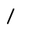

# Editor's notes for Ponish Manual

## Differences from original

- In some cases original images have earthographic and ponish side-by-side,
  which makes it hard to NOT read earthographic. I've split the images to remove
  the earthographic, but some overhang from earthographic is left, if you find
  some of the overhang confusing see the uncut original.
- Original manual has detailed photographs of written text on paper, some of
  them a bit blurry. I have compressed them using
  `convert -colorspace Gray -normalize -threshold 55%` for faster serving. If
  you can't read some of them here, check out the original PDF.
- Simplification to single-size vs double-size glyph choice is adopted: if the
  glyph in I/Y position is followed by a consonant, it is single-sized .
  - The original manual has a simple to describe but hard to implement choice:
    "if a chunk fits, glyphs can be double-sized".
  - One rule that can bring current mechanised implementation closer to the
    original is "if glyph ends in the top side of an imaginary glyph box
    (one-leg-A, E, L, P, R, U, V) it can be double-sized even if followed by a
    consonant.
- In lesson 3 the "success" example implies that the starting point of the S-S
  symbol is at the bottom of the circle. Drawing S-S from the bottom requires
  one and a half circle-strokes and one line-stroke or one circle-stroke and two
  line-strokes (one up and one down). "No wrong spelling", so I consider S-S
  starting point to be at the top of the circle.
- Only one version of "fect" and "logy" is implemented K-line/L-line second
  forms are used when affix precedes K or L, so that the combination forms a
  sine wave.
- In lesson 3 the prefixes and suffixes and corresponding examples are put into
  tables for easier scanning.
- In lesson 3 practice 3 the original image has two spellings of "other" ,
  separated by "/" , this is not re-produced.
- In part 2 passage 3 two-legged A is used in "across" instead of one-legged A.
  When using one-legged A you need to stroke forward and then back for the top
  of "c", which does not feel right.

## Comments on the original

- one leg A -  - can be distinguished from
  T -  - by the direction of drawing, A is drawn
  from bottom to top, T is drawn from top to bottom.
- Handling of leading and trailing vowels in prefixes and suffixes is
  inconsistent. In "anti-dot" "antid" is written WITHOUT a break after "i", but
  in "auto-mobile" "autom" is written WITH a break after "o". See also "peach".
- Y can be a vowel (my, happy, myth) or it can be a consonant (you, beyond),
  which makes it difficult to classify automatically.
  - For the "intermediate representation" I introduced "$(Y-consonant)" as a
    crutch to avoid making decision procedure too complicated. When writing from
    IPA this problem does not exist, as the consonant "Y" is translated to /j/ ,
    and vowel "Y" is translated to /aɪ/ or /i/ or /ɪ/ .
  - In my own writing I have switched to using "J" for the consonant Y, as in
    "you -> ju" and "beyond -> bijond", and to using "ai" or "i" for the vowel
    Y, as in "my -> mai" and "happy -> hapi" and "myth -> mi$(TH)" .
