# Lesson 1

This is the most basic level of Ponish. It consists of 29 letters, forming a
rough equivalent to the Latin alphabet, with 3 more letters which replace what
we here on Earth would write with digraphs, namely 'TH,' 'SH,' and 'CH.' Please
note that the letters themselves are more streamlined than their Latin
counterparts; A, for example has 3 strokes, like so, on the far left:

TODO: Alphabet drawing with stroke direction arrows

But in Ponish, the 2 figures to its right, it is written with only 2 strokes, or
even 1.

B, as well requires 3, but in Ponish, only 1. Observe:

And those aren't the only ones which are different. In fact, the entire alphabet
is designed with efficiency in mind. Why? Because fewer strokes means less
writing, which means both greater speed, and less strain to one's hand - or
mouth as it may be. If you so desire, you can count up the strokes required for
the normal Roman letters, and compare them to the number required for their
Ponish counterparts via the complete chart below, and see for yourselves just
how much writing is being saved with just a new alphabet.

| Character | Image                                                             |
| --------- | ----------------------------------------------------------------- |
| A         |  or  |
| B         |                                             |
| C         |                                             |
| D         |                                             |
| E         |                                             |
| F         | 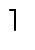                                            |
| G         |                                             |
| H         |                                             |
| I         | 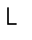                                            |
| J         | 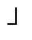                                            |
| K         |                                             |
| L         |                                             |
| M         |                                             |
| N         |                                             |
| O         |                                             |
| P         |                                             |
| Q         |                                             |
| R         | 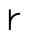                                            |
| S         |                                             |
| T         |                                             |
| U         | 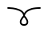                                            |
| V         |                                             |
| W         | 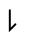                                            |
| X         | 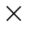                                            |
| Y         |                                             |
| Z         | 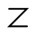                                            |
| SH        | 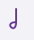                                          |
| TH        |                                           |
| CH        |                                           |

TODO: transpose the table to match the original format

You notice that A has 2 ways it can be written. This will be explained later,
but the important thing to keep in mind now, and always, is that each way is
equally valid. Not only this, but 'Q' can mean either 'Q' alone, or 'QU,' and
'W' can mean either 'W' alone, or 'WH.' You will see this in later examples.
Ponies, even those who have mastered the chirographic arts, will mix and match
spellings according to their own tastes, and the speed, space, or formality
restrictions under which they write.

EDITOR NOTE: one leg A -  - can be distinguished
from T -  - by the direction of drawing,
A is drawn from bottom to top, T is drawn from top to bottom.

This may seem strange, but reflect on how, for example, headlines are written on
Earth. Articles (a, an, the) can be dropped, capitalization, and punctuation
butchered, and sentence fragments twisted to fit rhyme, space, or innuendo. 'Man
Walks on Moon,' for one well-known instance. If you happen to be knowledgeable
about Japanese, the differences between polite, and everyday speaking also
provide a similar, illustration.

More on this will come later, but it's such an important concept that I think it
needs to be introduced now: there is no such thing as a wrong spelling , as long
as it successfully conveys the intended meaning. File that away in your
brain-housing group for later reference.

If you're wondering, dictionaries, especially those intended to be read by
foals, are often written out in their entirety, utilizing none of the
abbreviating tricks we will learn later. Ergo, there are official spellings, but
unofficial ones are not wrong.

Now, below you will see some samples written out in both orthographic English,
and Ponish. The student would do well to copy these, rather than attempt to
memorize the alphabet individually. The reason being that the connections in the
words themselves will help to solidify the shapes of the letters in her mind,
and to avoid the early-stage pitfall of being able to write them in order, but
not out of it; ask a child to write the ABCs and they probably can, but ask them
to write the ZYXs, or FUTLRs(random) then they're far less likely to be able to
do so, because they've only learned them in a specific order, A, then B, then C,
and don't yet possess sufficient facility to shake-n-bake. Writing words, rather
than letters from the get-go, will aid you in both learning, and attaining a
usable level of skill with the minimum of time, and effort expended.

## Examples:

The quick cute unicorn jumped over the lazy gryphon.

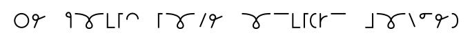

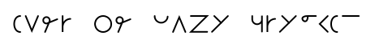

The vexed pegasus flew high, and shat on the land-bound Hydra.

The cheery and dutiful earth pony's pie won first place!

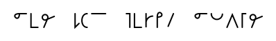

All 29 letters are demonstrated above. If you choose to stop your study here,
you are missing out, but will still possess a writing method marginally faster
than standard English, and likely to prevent casual spying on your journal.

But you really would be missing out!
