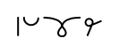
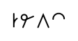
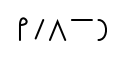
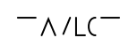

# Lesson 2

Now we're going to introduce a few little refinements into the system. These
will greatly decrease the space, and strain required, while also increasing your
speed! The first one is Ponish cursive ! I can hear you groan despite our
displacement in time, and space. There is no need; unlike in English cursive,
Ponish letters don't change. Ponish cursive is simple, and follows one rule:
DON'T LIFT THE PEN UNLESS THERE IS A VOWEL. See how simple that is? Merely begin
one letter from the ending of its predecessor. Like so:

B-L-U-E

BL-U-E

Notice how the B and L have been combined into a single character? Because we
didn't lift the pen until the vowel came. Here, again, this time B and R:

B-R-E-A-K

BR-E-A-K

EDITOR NOTE: BR is blended in the original, see TODO.md .

S-T-A-N-D

ST-A-ND

S-T-R-I-K-E

STR-I-K-E

EDITOR NOTE: TR is blended in the original, see TODO.md .

E-N-V-I-S-I-O-N

E-NV-I-SION

Woah! What happened with this one? Well, this is an example of both the
unfortunate disconnect between English spelling, and pronunciation (GHOTI,
anyone?), and also 2 important principles of Ponish: eliminate unnecessary
letters, and write things as they sound. In this case, the 'SION' sounds like
'SHN,' doesn't it? The 'SI' portion sounds like the 'SH/ZH' digraph, while the
'O' between it, and the 'N,' is inaudible, and therefore in Ponish, is not
written. The 'SH,' therefore, immediately goes into the 'N,' with no intervening
vowel, thus 'SION' becomes 'SHN,' in Ponish.

Other similar examples:

N-A-T-I-O-N

N-A-TION

P-A-S-S-I-O-N

P-A-SSION

Written by sound, not 'spelling.' Cool, hunh? And practical. I did include some
silent letters, which I normally wouldn't have done, for the sake of clarity,
but remember, there is no wrong spelling.

Moving right along to the second part of the lesson : letter placement. It
matters! You see, in Ponish, the line of writing can be divided up into 3 areas
like so:

WARNING: image is missing

TODO: line of writing

The first letter of the word, in this example 'A' forms the 'base' of the word,
its anchor. Anything in the space above it is in the A/E line, anything even
with its top is in the I/Y line, and anything below the half-way mark is in O/U
line. The function of this is to (mostly) eliminate vowels in writing, thus
making it faster, and more compact, without producing a gobbledygook of
consonants you would become less, and less likely to decipher as time went on.
Looking at you, Teeline, Quickhand, and others.

So, how do we make use of these divisions? 2 ways. The first, being that when
you write a word, for example 'bag,' you write the first letter, B as the
anchor, then the next consonant, G with its top even with the A/E line:

This can also mean beg, of course, but context will tell you which you mean. If
you write the G along the I/Y line, you instead write the word 'big:'

And if you write the G with the O/U line, you produce both 'bog,' and 'bug:'

As before, context will be your guide; 'there's a bug in my rice,' vs. 'there's
a bog in my rice;' one makes sense, the other doesn't. For those instances where
you wish to be absolutely certain, you can merely write the word out in full, as
we did in lesson 1.

You may notice that some words resemble numbers. This is usually not a problem
because of, again, context, but to make sure, simply circle your numbers, or
underline them. This is demonstrated in Part 2 of the manual, if you wish to
flip ahead and see it in use right now. But be warned, you are unlikely to be
able to read the passages in which those examples are couched.

Here are some more examples of line-position vowels in action:

WARNING: image is missing

But what if it's a dipthong, i.e. if the next discernible sound is also a vowel?
No problem, just write the second vowel in the line-position of the first, like
so:

WARNING: image is missing

And if the final sound in a word is a vowel? Indicate it with a dot, like this:

WARNING: image is missing

What if it starts with a vowel? Write it, then proceed as normal:

WARNING: image is missing

The third, and final refinement we're going to introduce in this lesson is also
the simplest, thank Celestia. After all this, you're probably glad to hear it.
This is a lot to take in in a single lesson, believe me, I know, but these 3
techniques of Ponish work synergistically together, and so should be introduced
together, that they might be practiced together, from the first. Chin up, if the
little colts, and fillies can handle it, so can you!

So, what is this last thingie? It is...the dot! Quick, easy, and full of
meaning, depending on it's place. Fortunately, unlike Gregg, it only has 2: if
you put it in the top left corner of the word you are writing, it stands in for
the indefinite articles 'a,' and 'an,' but if you put it in the bottom left
corner, it stands for 'the,' like so:

WARNING: image is missing

Did you know those are the most commonly written words? Well they are. Think of
how many times you use them, and by reducing them to mere dots, think of all the
writing we are saving: 6 strokes for 'the,' 4 strokes for 'an,' and 2 strokes
for 'a,' over, and over, and over again. Now, you can just put a dot, instead.
Isn't that easier?

Cool, hunh? And so simple.

We're only on the 2 nd lesson, and just look at how much space is saved in these
example sentences:

WARNING: image is missing

You should also notice that the 'A' in 'Armor,' 'Are,' and 'And,' are written
with a single stroke. This is done when the A leads into another letter so as to
save time, and space. You may, of course use the 2-stroke A if you prefer.
Furthermore, it is, in fact, usual for the 'A' stroke to be entirely omitted
when writing 'And,' but again, there is no wrong spelling.

Before we move on, I'd like you to go back, and take a moment to appreciate, if
you haven't already, the difference in the page-space required to write things
Earthographically (Earth-orthographically), as opposed to in Ponish. Yes, I just
said it, and I'm saying it again: even here, in only the 2 nd lesson, the
difference was noticeable, and it's about to get a whole lot more so; please
read the passage below, and copy it too. Do this until you can do it easily, and
without much conscious effort; you're aiming for the unconscious-competence
phase here.

Try to figure out the meaning of the passage on your own, if you can't, don't
worry. Unlike the Ferengi at Gregg Publishing, I will include the Earthographic
transcription below this insert, rather than making you buy a separate edition
to get the answers. If you like, write it out as well, and compare the length of
the Earthographic, and Ponish passages; the difference is significant, isn't it?
Imagine how much time, and space you'll be saving writing this way, and we
aren't even through with the lessons yet!

While you're reading, keep in mind: no wrong spelling , and sound, not spelling
.

WARNING: image is missing

Ready for the answer? Here you go:

## Lesson 2 Passage:

Between the times when the oceans drank Atlantis, and the rise of the sons of
Aryas, there was an age undreamed of. And unto this: Conan. Destined to bear the
jeweled crown of Aquilonia upon a troubled brow. It is I, his chronicler who
alone can tell thee of his saga. Let me tell you of the days of high adventure!

One more thing. I really must emphasize the importance of practicing both
reading, and writing. If you only write Ponish, then when you try to read back
what you have written, even when you can write quickly, you will be slow, and
clumsy. The 2 skills will not grow up together unless you practice them
together. You need to both read, and write, so practice both reading, and
writing. I would not have taken the time to write this paragraph if I did not
think it important, so please, take it to heart, and practice both skills.
