# Lesson 3

Ok, well, if you've made it this far, thank you. Just as the 2 nd lesson
introduced useful refinements of what we learned in lesson 1, so shall lesson 3.
You don't need the stuff in this lesson to have a usable, and practical system
of writing, but you'll only improve by persevering. In this lesson, we're going
to introduce the concept of combined sounds, and special symbols for commonly
encountered prefixes and suffixes. We'll do the sounds first, since they're
fewer in number. In fact, there are only 5.

## 1. (th(vowel)NG)

See that little round 'TH' symbol? Draw a little curved line off of it, and you
have a symbol which on it's own means 'thing,' but when combined with other
letters can mean that, or stand for the very common NG sound combination:

| Earthographic  | Ponish                        |
| -------------- | ----------------------------- |
| ing, ng, thing | 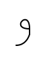     |
| something      | 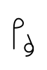 |
| going          | 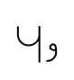     |
| twang          | 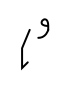     |

## 2. (th(vowel)NK)

It's the same little symbol as above, but with the tail on the other side, and
this time it means 'think,' or when written into another word, it means 'NK/NC,'
hard C-sound only.

| Earthographic        | Ponish                        |
| -------------------- | ----------------------------- |
| nk, nc, think, thank | 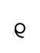     |
| bank                 | 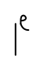      |
| flunk                | 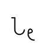     |
| thank you            | 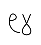 |

## 3. (pr(vowel))

Same symbol (noticing a pattern here? Keeps it simple, and easy to remember) but
this time with the tail on top. Notice how it resembles a normal P and R joined
the usual way.

| Earthographic | Ponish                      |
| ------------- | --------------------------- |
| pr            | 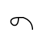      |
| private       | 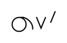 |
| project       | 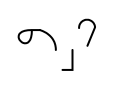 |
| preview       | 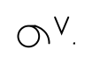 |

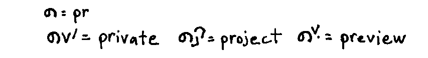

## 4. (pl(vowel))

Once more, the same symbol, but with the tail on the bottom, closely resembling
an L. Isn't that convenient?

| Earthographic | Ponish                       |
| ------------- | ---------------------------- |
| pl            | 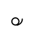       |
| pleasure      | 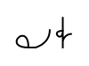 |
| plastic       | 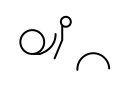  |
| plebian       | 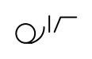  |

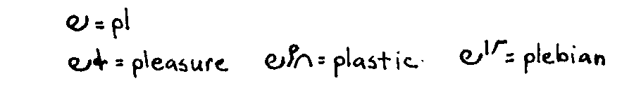

## 5 (S(vowel)S)

Finally, something new! But still very similar to the base of the sound
combination it represents, in this case 'S.'

| Earthographic | Ponish                       |
| ------------- | ---------------------------- |
| s(vowel)s     |        |
| princess      | 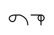 |
| success       | 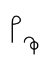  |
| misses        | 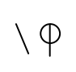   |

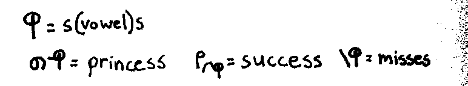

EDITOR NOTE: the "success" example in the original implies that the starting
point of the S-S symbol is at the bottom of the circle, drawing S-S from the
bottom requires one and a half circle-strokes and one line-stroke or one
circle-stroke and two line-strokes (one up and one down). "No wrong spelling",
so I consider S-S starting point to be at the top of the circle.

## Prefixes and suffixes

And here is the next part of lesson 3: Pre, and suffixes. Nothing much to
explain here, just a chart for you to memorize. Note that some of these are
entire words in their own right. Don't hesitate to use them as such. Enough
talk! Have at thee!

| Earthographic     | Ponish                                | Original image                               |
| ----------------- | ------------------------------------- | -------------------------------------------- |
| above, about      |      | 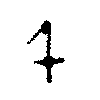     |
| anti, auto        | 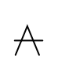      | 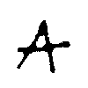      |
| awa(y)            | 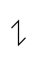      | 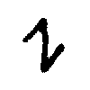      |
| circ(u)(um)       | 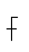      | 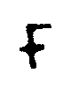      |
| com, con, contr   | 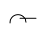       | 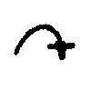       |
| dis, des          | 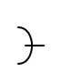       | 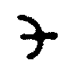       |
| each              | 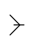      | 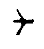      |
| fect              | 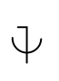      | 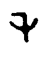      |
| full              | 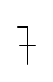      | 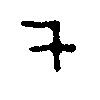      |
| graph, gram       | 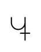     | 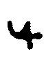     |
| hood              |       |       |
| ify               | 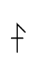       | 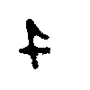       |
| ifycation         | 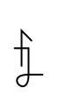 |  |
| less              | 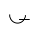      |       |
| logy, logic       | 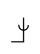      | 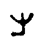      |
| mis, ment         |        |        |
| ness              | 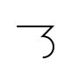      | 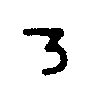      |
| over, other, out  | 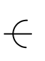      |       |
| self              |       |       |
| semi              |       |       |
| ship              |       |       |
| sub               |        |        |
| super             |      |      |
| trans             |      |      |
| under             |      |      |
| ever, every, very |       |       |
| ward              |       |       |

This may seem like a lot, but keep in mind that you don't have to use them, they
will simply make you better than you might have otherwise been, which is still
better than someone who can't even do the basics. If you want to learn these,
take note that many of them are simply letters of the Ponish alphabet with lines
drawn through them.

It might help you to get a better idea of how they are used if you see them in
action. Here they are, at least one of each, used in a word or short phrase.
Please pay attention to the way that the letter-base of the symbol is written
first, then the line through it, and that the continuations are written from the
end of that line, just like in ordinary Ponish cursive. The height of the line
may be raised or lowered to better accommodate the following symbols.

The picture below contains only the Ponish writings, but the Earthographics are
included directly below, if you need a translation.

### Examples, Row 1: Above ground, Lay about, Antidote, Automobile, Await, Go away, Circulate, Circumscribe

TODO [automobile]: prefix ending in a vowel has vowel effect on the next glyph?

| Earthographic | Ponish                                         | Original image                                        |
| ------------- | ---------------------------------------------- | ----------------------------------------------------- |
| above ground  |   |   |
| lay about     |      |      |
| antidote      |      |      |
| automobile    |    |    |
| await         |         |         |
| go away       |        |        |
| circulate     |     |     |
| circumscribe  |  |  |

### Examples, Row 2: Compose, Construct, Contradiction, Disparage, Destitute, Peach, Infect, Infection

TODO [peach]: suffix starting with a vowel acts like a vowel?

| Earthographic | Ponish                                          | Original image                                         |
| ------------- | ----------------------------------------------- | ------------------------------------------------------ |
| compose       |        |        |
| construct     |      |      |
| contradiction |  |  |
| disparage     |      |      |
| destitute     |      |      |
| peach         |          |          |
| infect        |         |         |
| infection     |      |      |

### Examples, Row 3: Spiteful, Spitefulness, Graphic, Grammar, Sluthood, Pacify, Pacification, Guileless, Guilelessness

| Earthographic | Ponish                                          | Original image                                         |
| ------------- | ----------------------------------------------- | ------------------------------------------------------ |
| spiteful      |       |       |
| spitefulness  |   |   |
| graphic       |        |        |
| grammar       |        |        |
| sluthood      |       |       |
| pacify        |         |         |
| pacification  |   |   |
| guileless     |      |      |
| guilelessness |  |  |

### Examples, Row 4: Biology, Illogical, Misrepresent, Mismanagement, Cleanliness, Overdone,

Otherwise, Outspoken

| Earthographic | Ponish                                          | Original image                                         |
| ------------- | ----------------------------------------------- | ------------------------------------------------------ |
| biology       |        |        |
| illogical     |      |      |
| misrepresent  |   |   |
| mismanagement |  |  |
| cleanliness   |    |    |
| overdone      |       |       |
| otherwise     |      |      |
| outspoken     |      |      |

### Examples, Row 5: Self publish, Semi truck, Battleship, Shipment, Subway, Subject, Supersonic, Superluminal

| Earthographic | Ponish                                         | Original image                                        |
| ------------- | ---------------------------------------------- | ----------------------------------------------------- |
| self publish  |   |   |
| semi truck    |     |     |
| battleship    |    |    |
| shipment      |      |      |
| subway        |        |        |
| subject       |       |       |
| supersonic    |    |    |
| superluminal  |  |  |

### Examples, Row 5: Transit, Transfer, Undergo, Blunder, Forever, Everybody, Variable, Very good

| Earthographic | Ponish                                      | Original image                                     |
| ------------- | ------------------------------------------- | -------------------------------------------------- |
| transit       |    |    |
| transfer      |   |   |
| undergo       |    |    |
| blunder       |    |    |
| forever       |    |    |
| everybody     |  |  |
| variable      |   |   |
| very good     |   |   |

### Examples, Row 5: Toward, Downwards, Warden, Ward away.

| Earthographic | Ponish                                      | Original image                                     |
| ------------- | ------------------------------------------- | -------------------------------------------------- |
| toward        |     |     |
| downwards     |  |  |
| warden        |     |     |
| ward away     |   |   |

And to close up the lesson, here is some more reading practice:

## Practice

EDITOR NOTE: original images have earthographic and ponish side-by-side, which
makes it hard not to read earthographic. I've split the images to remove the
earthographic, but some overhang from earthographic is left, please ignore.

### Practice 1

Earthographic

Every corpse on mount everest was once an extremly motivated person

### Practice 2

 

 

Earthographic

The bigger you build the bonfire, the more darkness is revealed

### Practice 3

Some longer things, perhaps? As before, the Earthographic can be found beneath
the images, but you'll get the most out of it if you read, and copy it on your
own.

EDITOR NOTE: In the original image two spellings of "other" are used, separated
by "/"

Earthographic

It's so frustrating being a girl and trying to flirt with other girls.
Like you tell them they're cute and they go "aww thank you!"
No. No I'm being gay with you. Homo intended. Damnit.

### Lesson 3 Passage

 

 

 

 

 

And the answer to the above example:

On the subway, today a man came up to me to start a conversation. He made small
talk. He was a lonely man, talking about the weather, and other things. I tried
to be pleasant, and accommodate him, but my head began to hurt from his
banality. I almost didn't notice it had happened, but I threw up all over him.
He was not pleased. I couldn't stop laughing.

