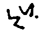
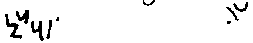
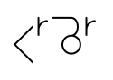
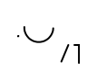
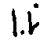
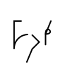
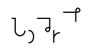
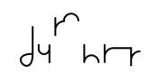
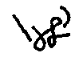

# Lesson 4

This is the final lesson. Congratulations. Herein we will go over 2 techniques
for further reducing time, and volume, then wash it all down with a lot more
reading, and writing practice. When this is all done, I would suggest you copy
passages of books you like, movie lines, forum posts, etc. Things that will give
you a wide variety of topics, and words so you can utilize all you have learned.

As you become more, and more proficient, you will begin to write almost as
quickly as someone can talk - at a normal pace - seize this skill by watching
your entertainment of the night with a pencil, and notepad on your lap, and try
to transcribe the scenes as they unfold. This will be very difficult at first,
even if you are already proficient at writing, but if you persevere, you will
find the gap between the words coming out of the TV, and the words scrawling
across your page to be waning with each session.

Good luck.

Now then, the first technique of this lesson is called phrasing . What this
means is, combining separate words into single ones; writing many words together
as one word. There is a little bit of this in the practice writing above, but
only a little.

The words this is most commonly done with are prepositions, and possessive
pronouns. 'To go to' becomes:

| Earthographic     | Ponish                        |
| ----------------- | ----------------------------- |
| to go to          |  |
| to go to the mall |  |

Original manual image

Side by side with original manual image

<table>
<thead>
<tr>
<th>Earthographic</th>
<th>Ponish</th>
<th>Original image</th>
</tr>
</thead>
<tbody>
<tr>
<td>to go to</td>
<td></td>
<td></td>
</tr>
<tr>
<td>to go to</td>
<td></td>
<td></td>
</tr>
</tbody>
</table>

---

While 'I have to' yields:

| Earthographic            | Ponish                        |
| ------------------------ | ----------------------------- |
| I have to                |  |
| I have to go to the mall |  |

Original manual image

Side by side with original manual image

<table>
<thead>
<tr>
<th>Earthographic</th>
<th>Ponish</th>
<th>Original image</th>
</tr>
</thead>
<tbody>
<tr>
<td>I have to</td>
<td></td>
<td></td>
</tr>
<tr>
<td>I have to go to the mall</td>
<td></td>
<td></td>
</tr>
</tbody>
</table>

---

And so on. Just look at all that saved space! Here are some more examples:

| Earthographic                               | Ponish                        |
| ------------------------------------------- | ----------------------------- |
| As fast as possible                         |  |
| Be right back                               |  |
| Before you know it                          |  |
| By all means                                |  |
| By the way                                  |  |
| Here and there                              |  |
| In fact                                     |  |
| In my defense                               |  |
| A lot of                                    |  |
| Now and then                                |  |
| They can not                                |  |
| You will not be able to                     |  |
| We are the priests of the temples of syrinx |  |

TODO: "sts" in "priests"

Original manual image

Side by side with original manual image

<table>
<thead>
<tr>
<th>Earthographic</th>
<th>Ponish</th>
<th>Original image</th>
</tr>
</thead>
<tbody>
<tr>
<td>As fast as possible</td>
<td></td>
<td></td>
</tr>
<tr>
<td>Be right back</td>
<td></td>
<td></td>
</tr>
<tr>
<td>Before you know it</td>
<td></td>
<td></td>
</tr>
<tr>
<td>By all means</td>
<td></td>
<td></td>
</tr>
<tr>
<td>By the way</td>
<td></td>
<td></td>
</tr>
<tr>
<td>Here and there</td>
<td></td>
<td></td>
</tr>
<tr>
<td>In fact</td>
<td></td>
<td></td>
</tr>
<tr>
<td>In my defense</td>
<td></td>
<td></td>
</tr>
<tr>
<td>A lot of</td>
<td></td>
<td></td>
</tr>
<tr>
<td>Now and then</td>
<td></td>
<td></td>
</tr>
<tr>
<td>They can not</td>
<td></td>
<td></td>
</tr>
<tr>
<td>You will not be able to</td>
<td></td>
<td></td>
</tr>
<tr>
<td>We are the priests of the temples of syrinx</td>
<td></td>
<td></td>
</tr>
</tbody>
</table>

---

Other times, words which are written separately Earthographicaly, like street
light, or clothes horse, would be joined together as one, like so:

| Earthographic     | Ponish                        |
| ----------------- | ----------------------------- |
| clothes horse     |  |
| crotch tits       |  |
| flood insurance   |  |
| horse pussy       |  |
| mouse pad         |  |
| poison joke       |  |
| rocking chair     |  |
| street light      |  |
| sugar cube corner |  |
| swimming pool     |  |
| swing set         |  |
| water bottle      |  |

Original manual image

Side by side with original manual image

<table>
<thead>
<tr>
<th>Earthographic</th>
<th>Ponish</th>
<th>Original image</th>
</tr>
</thead>
<tbody>
<tr>
<td>clothes horse</td>
<td></td>
<td></td>
</tr>
<tr>
<td>crotch tits</td>
<td></td>
<td></td>
</tr>
<tr>
<td>flood insurance</td>
<td></td>
<td></td>
</tr>
<tr>
<td>horse pussy</td>
<td></td>
<td></td>
</tr>
<tr>
<td>mouse pad</td>
<td></td>
<td></td>
</tr>
<tr>
<td>poison joke</td>
<td></td>
<td></td>
</tr>
<tr>
<td>rocking chair</td>
<td></td>
<td></td>
</tr>
<tr>
<td>street light</td>
<td></td>
<td></td>
</tr>
<tr>
<td>sugar cube corner</td>
<td></td>
<td></td>
</tr>
<tr>
<td>swimming pool</td>
<td></td>
<td></td>
</tr>
<tr>
<td>swing set</td>
<td></td>
<td></td>
</tr>
<tr>
<td>water bottle</td>
<td></td>
<td></td>
</tr>
</tbody>
</table>

---

The last technique is the utilization of short forms. These are not
standardized, and are not often used for communication wherein some outside
party is expected to understand it, but there are exceptions, notably within
industries, and professions that have a great deal of specialized knowledge, and
vocabulary.

For the most part, short forms are unique to the one who uses them. The most
unique thing about Ponish short forms is that there is a standard way to
communicate them. That is, when a word is first used, the whole form of the word
is written out, then it is labeled with a number, this number is then written
either forward of the main body, or as a post-script, and all other mentions of
the same word are short-formed by writing the number, instead of the word
itself.

This lesson's examples don't need to be memorized per se, only understand the
concepts, and apply, and adapt them to suit your needs. You'll make up your own
phrases, and short forms to suit your purposes as your practice, and employment
progresses.

There isn't really a limit here, but the more you write this way, i.e. the more
phrasing, and short forms you use, the more difficult it will be for you to read
it; exercise caution until you are certain you have the requisite skill.

And that's it, you've done it! Congratulations, you can now write like a pony.
If you ever manage to find your way to Equestria, you'll be that much more
prepared, and even if you don't, it's still a useful skill to possess on this
side of The Dreaming.

Now then, let's end the booklet with some more practice material. Enjoy!

---

[Next: Part 2](./part-2.md)

[Back: Lesson 3](./part-1-lesson-4.md)
