# Part 2: Further Readings, and Their Earthographic Transcriptions

## Passage 1 (Ponish)

<table>
<tbody>
<tr><td></td></tr>
<tr><td></td></tr>
<tr><td></td></tr>
<tr><td>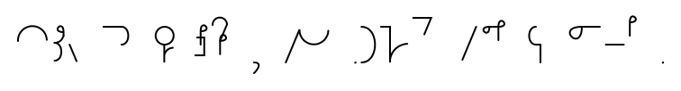</td></tr>
<tr><td>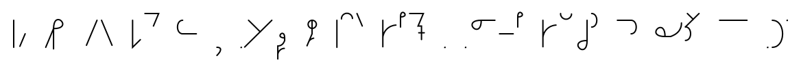</td></tr>
<tr><td></td></tr>
<tr><td></td></tr>
<tr><td></td></tr>
<tr><td>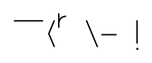</td></tr>
<tr><td>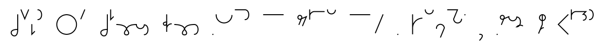</td></tr>
<tr><td>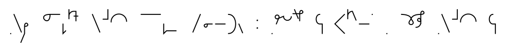</td></tr>
<tr><td>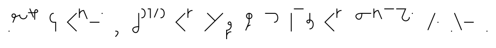</td></tr>
<tr><td>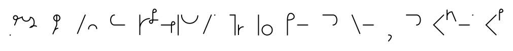</td></tr>
<tr><td></td></tr>
</tbody>
</table>

Earthographic

Once upon a time, in the magical land of Equestria, there were two regal sisters
who ruled together and created harmony for all the land. To do this, the eldest
used her unicorn powers to raise the sun at dawn; the younger brought out the
moon to begin the night. Thus, the two sisters maintained balance for their
kingdom and their subjects, all the different types of ponies.

 

But as time went on, the younger sister became resentful. The ponies relished
and played in the day her elder sister brought forth, but shunned, and slept
through her beautiful night. One fateful day, the younger unicorn refused to
lower the moon to make way for the dawn. The elder sister tried to reason with
her, but the bitterness in the young one's heart had transformed her into a
wicked mare of darkness: Nightmare Moon!

 

She vowed that she would shroud the land in eternal night. Reluctantly, the
elder sister harnessed the most powerful magic known to Ponydom: the Elements of
Harmony. Using the magic of the Elements of Harmony, she defeated her younger
sister, and banished her permanently in the moon. The elder sister took on
responsibility for both sun, and moon, and harmony has been maintained in
Equestria for generations since.

Original manual image

Side by side with original manual image

<table>
<tbody>
<tr><td> </td></tr>
<tr><td> </td></tr>
<tr><td> </td></tr>
<tr><td> </td></tr>
<tr><td> </td></tr>
<tr><td> </td></tr>
<tr><td> </td></tr>
<tr><td> </td></tr>
<tr><td> </td></tr>
<tr><td> </td></tr>
<tr><td> </td></tr>
<tr><td> </td></tr>
<tr><td> </td></tr>
<tr><td> </td></tr>
</tbody>
</table>

## Passage 2:

<table>
<tbody>
<tr><td>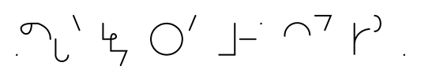</td></tr>
<tr><td>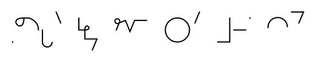</td></tr>
<tr><td></td></tr>
<tr><td>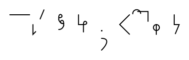</td></tr>
<tr><td></td></tr>
</tbody>
</table>

Earthographic

The problem isn't that Johnny can't read .
The problem isn't even that Johnny can't think.
The problem is that Johnny doesn't know what thinking is;
he confuses it with feeling.

Original manual image

Side by side with original manual image

<table>
<tbody>
<tr><td> </td></tr>
<tr><td> </td></tr>
<tr><td> </td></tr>
<tr><td> </td></tr>
<tr><td> </td></tr>
</tbody>
</table>

## Passage 3

<table>
<tbody>
<tr><td>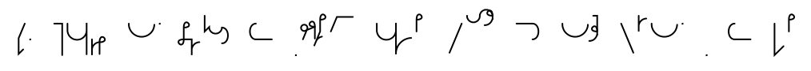</td></tr>
<tr><td></td></tr>
<tr><td></td></tr>
<tr><td>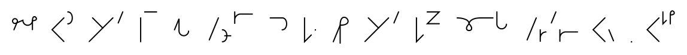</td></tr>
<tr><td>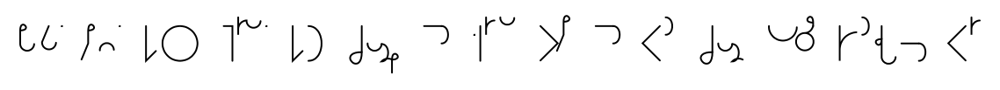</td></tr>
<tr><td></td></tr>
<tr><td></td></tr>
<tr><td>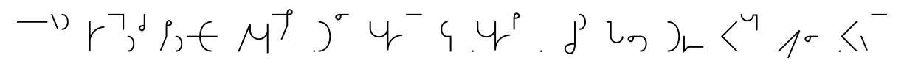</td></tr>
<tr><td>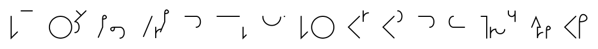</td></tr>
<tr><td>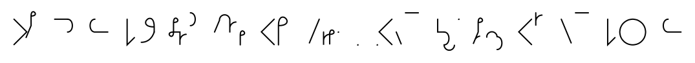</td></tr>
<tr><td>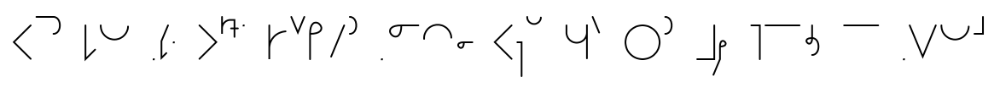</td></tr>
<tr><td></td></tr>
</tbody>
</table>

Earthographic

Two figures lay sprawled on the Equestrian grass, talking and laughing merrily.
One was human; a relatively young man with the unlikely name of Lero, (short for
Bellerophon, for his parents had been odd folk) who'd ended up here through no
mechanism he or anyone else had yet been able to discern, and who as yet was
unable to return home. He was slightly stocky, with fairly wide shoulders and a
barrel chest, and had shoulder-length, reddish-blonde hair and a neatly trimmed
red mustache and goatee.

 

The other figure was much smaller. The sky-blue coat and rainbow-striped mane
and tail of the pegasus aptly named Rainbow Dash stood out against the deep
green of the grass. She'd flopped down half atop the human when they'd stopped
to rest, and now lay with her head and one foreleg across his chest and one wing
spread across his torso. The human idly stroked her mane with one hand while the
two cheerfully revisited the pickup hoofball game they'd just finished in the
village green.

Original manual image

Side by side with original manual image

<table>
<tbody>
<tr><td> </td></tr>
<tr><td> </td></tr>
<tr><td> </td></tr>
<tr><td> </td></tr>
<tr><td> </td></tr>
<tr><td> </td></tr>
<tr><td> </td></tr>
<tr><td> </td></tr>
<tr><td> </td></tr>
<tr><td> </td></tr>
<tr><td> </td></tr>
<tr><td> </td></tr>
</tbody>
</table>

## Passage 4:

<table>
<tbody>
<tr><td></td></tr>
<tr><td>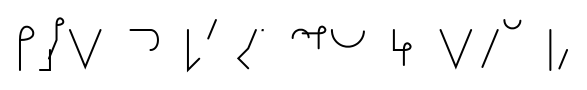</td></tr>
<tr><td></td></tr>
<tr><td>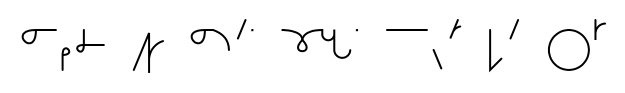</td></tr>
<tr><td>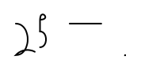</td></tr>
</tbody>
</table>

Earthographic

Satistics are like bikinis; what they reveal is
suggestive, and what they conceal is vital... but
inaccuracies made in an effort to promote a
pet position are pretty ugly no matter what they're dressed in.

Original manual image

Side by side with original manual image

<table>
<tbody>
<tr><td> </td></tr>
<tr><td> </td></tr>
<tr><td> </td></tr>
<tr><td> </td></tr>
<tr><td> </td></tr>
</tbody>
</table>

## Passage 5

<table>
<tbody>
<tr><td></td></tr>
<tr><td>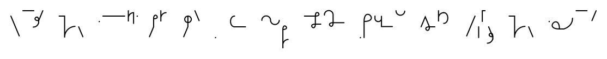</td></tr>
<tr><td></td></tr>
<tr><td>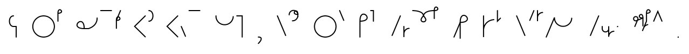</td></tr>
<tr><td></td></tr>
<tr><td></td></tr>
<tr><td>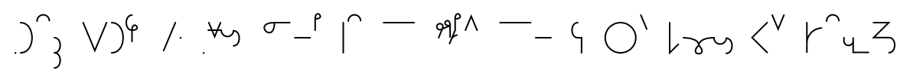</td></tr>
<tr><td></td></tr>
<tr><td>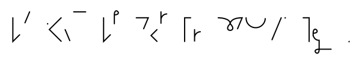</td></tr>
<tr><td></td></tr>
<tr><td></td></tr>
</tbody>
</table>

Earthographic

Fifteen galaxies out from Equestria, one of Celestia's copies noticed an odd
radio signal emanating from a nearby star system. On closer inspection, the
signals appeared to be coming from a planet. She had seen many planets give off
complex, non-regular radio signals, but upon investigation, none of those
planets had human life, making them safe to reuse as raw material to grow
Equestria.

 

She studied the signals carefully for years while she traveled through
interstellar space. The more she saw, the more confident she was that these
signals were sent by humans. Celestia predicted that if she showed the decoded
videos to the very old ponies back in Equestria, none of them would have
recognized the creatures with six appendages as humans. But that didn't matter.
Hanna had written a definition of what a human was into her core utility
function.

 

The copy of Princess Celestia knew what she had to do. She had to satisfy their
values through friendship and ponies.

Original manual image

Side by side with original manual image

<table>
<tbody>
<tr><td> </td></tr>
<tr><td> </td></tr>
<tr><td> </td></tr>
<tr><td> </td></tr>
<tr><td> </td></tr>
<tr><td> </td></tr>
<tr><td> </td></tr>
<tr><td> </td></tr>
<tr><td> </td></tr>
<tr><td> </td></tr>
<tr><td> </td></tr>
</tbody>
</table>

## Passage 6:

<table>
<tbody>
<tr><td></td></tr>
<tr><td></td></tr>
<tr><td></td></tr>
</tbody>
</table>

Earthographic

He who will not reason is a bigot;
he who cannot , is a fool;
and he who dares not, is a slave.

Original manual image

Side by side with original manual image

<table>
<tbody>
<tr><td> </td></tr>
<tr><td> </td></tr>
<tr><td> </td></tr>
</tbody>
</table>

## Passage 7:

<table>
<tbody>
<tr><td></td></tr>
<tr><td></td></tr>
<tr><td>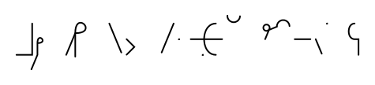</td></tr>
<tr><td></td></tr>
<tr><td></td></tr>
</tbody>
</table>

Earthographic

What we experience in dreams - assuming that
we experience it often - belongs in the end
just as much to the overall economy of
our soul as anything experienced "actually;" we
are richer or poorer on account of it.

Original manual image

Side by side with original manual image

<table>
<tbody>
<tr><td> </td></tr>
<tr><td> </td></tr>
<tr><td> </td></tr>
<tr><td> </td></tr>
<tr><td> </td></tr>
</tbody>
</table>

## Passage 8, part 1

<table>
<tbody>
<tr><td></td></tr>
<tr><td>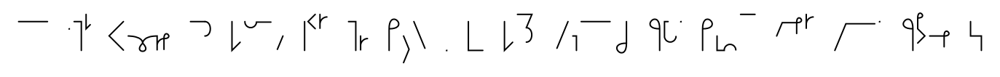</td></tr>
<tr><td></td></tr>
<tr><td>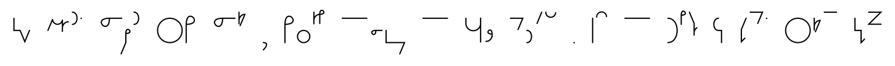</td></tr>
<tr><td>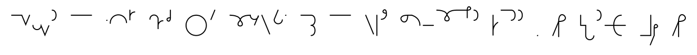</td></tr>
<tr><td></td></tr>
<tr><td></td></tr>
<tr><td>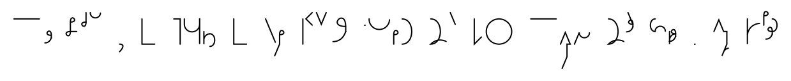</td></tr>
<tr><td>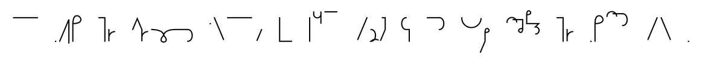</td></tr>
<tr><td></td></tr>
<tr><td></td></tr>
<tr><td></td></tr>
<tr><td>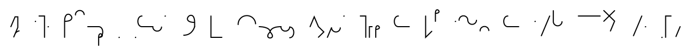</td></tr>
<tr><td></td></tr>
<tr><td></td></tr>
<tr><td></td></tr>
<tr><td></td></tr>
<tr><td>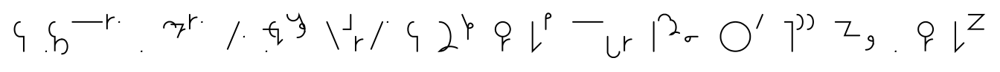</td></tr>
<tr><td>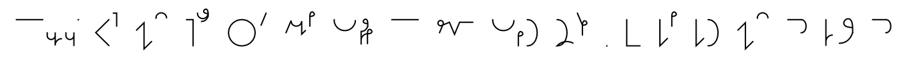</td></tr>
<tr><td>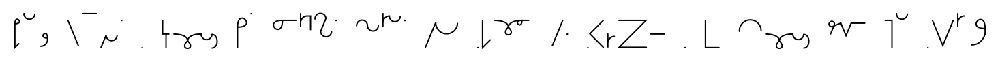</td></tr>
<tr><td></td></tr>
<tr><td></td></tr>
<tr><td></td></tr>
<tr><td>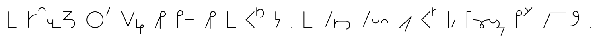</td></tr>
<tr><td>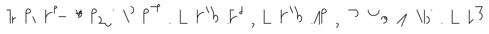</td></tr>
<tr><td></td></tr>
<tr><td></td></tr>
<tr><td>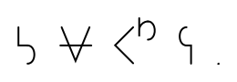</td></tr>
</tbody>
</table>

Earthographic

I'd like to preface this by saying I deeply apologize for the drop in writing
quality towards the end. I have to leave in a few hours and will not be here for
some time. I wanted to finish quickly so I can answer any questions, if anyone's
even here right now.

 

I've already posted this part, so there's no point in going into detail. Back in
December of 2013 I was involved in a car crash that ultimately ended in my being
pronounced brain dead. As I bled out just as the paramedics arrived and died ~40
minutes later.

 

It took place in three different locations. At first, I became self aware in an
abyss. This in and of itself was nothing special, I figured I must be having a
lucid dream with no actual dreaming occurring. After residing in the abyss for
around a minute, I began to drift off and lost consciousness for the second
time.

 

The second location was possibly the most generic one - I was in the hospital
room. Although I had no physical body, my vision was positioned as if I were
leaning over the cot and staring at myself in this stage of the experience. I
couldn't focus on anything. I tried to understand what was happening, but
completely forgot my trail of thought after a few seconds. The only thing I
could actually focus on was a clock on a table next to the cot, which read
4:18pm. The same drowsy feeling from the abyss returned, and I faded from
consciousness again.

 

I had now spent a collective time of ~2minutes in the abyss and the room.

 

The third location was entirely inexplicable. Rather than being in the hospital
bed I was propped up against a tree in a small field. The sun was beginning to
set over the ocean in the distance and, location aside nothing was out of the
ordinary. Contrary to the overwhelming majority of dreams, there was no blurry
backdrop that faded into nothing. There was no groggy, half-awake feeling that
always lingers in even lucid dreams. I was wide awake and breathing and
swallowing manually. I could see perfectly clearly all the way up to the
horizon. I could even feel the varying levels of pain when I tested. For a
moment, I thought I was actually awake.

 

That's when I heard her.

 

\> "Everything is going to be all right, Anon."

 

I recognized that voice as soon as I heard it. I turned to look at her, but
couldn't say anything. For some reason, everything suddenly made sense. I
remembered the crash, I remembered the abyss, and looking at my body. I wanted
to think I was still alive and it was just a dream, but I knew I had died.

 

I've never been a religious or spiritual person. As such, I chalked the whole
thing up to every explanation to NDEs I'd ever heard of.

Original manual image

Side by side with original manual image

<table>
<tbody>
<tr><td> </td></tr>
<tr><td> </td></tr>
<tr><td> </td></tr>
<tr><td> 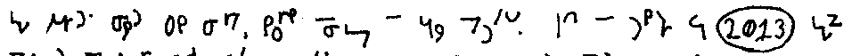</td></tr>
<tr><td> </td></tr>
<tr><td> </td></tr>
<tr><td> </td></tr>
<tr><td> 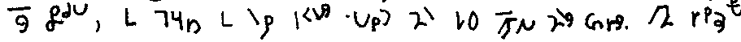</td></tr>
<tr><td> </td></tr>
<tr><td> 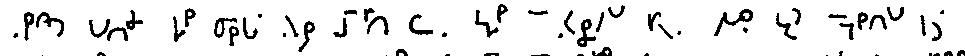</td></tr>
<tr><td> </td></tr>
<tr><td> </td></tr>
<tr><td> </td></tr>
<tr><td> </td></tr>
<tr><td> </td></tr>
<tr><td> </td></tr>
<tr><td> </td></tr>
<tr><td> 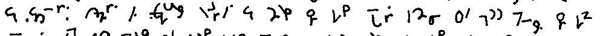</td></tr>
<tr><td> </td></tr>
<tr><td> </td></tr>
<tr><td> </td></tr>
<tr><td> </td></tr>
<tr><td> </td></tr>
<tr><td> </td></tr>
<tr><td> </td></tr>
<tr><td> </td></tr>
<tr><td> </td></tr>
<tr><td> </td></tr>
</tbody>
</table>

## Passage 8, part 2

<table>
<tbody>
<tr><td>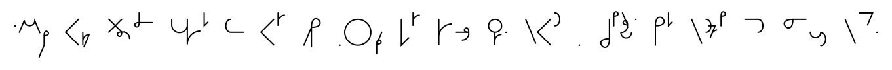</td></tr>
<tr><td></td></tr>
<tr><td>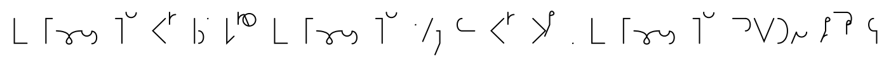</td></tr>
<tr><td>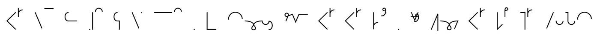</td></tr>
<tr><td></td></tr>
<tr><td></td></tr>
<tr><td>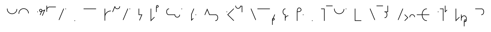</td></tr>
<tr><td>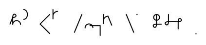</td></tr>
<tr><td>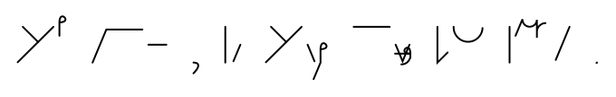</td></tr>
<tr><td></td></tr>
<tr><td></td></tr>
<tr><td></td></tr>
<tr><td>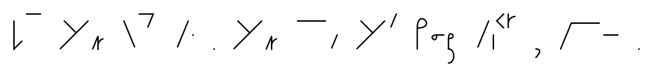</td></tr>
<tr><td>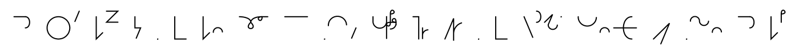</td></tr>
<tr><td>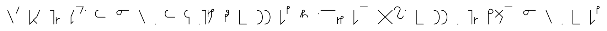</td></tr>
<tr><td></td></tr>
<tr><td></td></tr>
<tr><td></td></tr>
<tr><td></td></tr>
<tr><td></td></tr>
</tbody>
</table>

Earthographic

An almost hurt expression grew on her as the thoughts were running through my
head. She seemingly saw my distress and pulled me into a hug.

 

I could feel her body warmth. I could feel a tuft on her chest. I could feel
individual strands of her mane on the back of my neck. I could even hear her
breathing. Everything about her was far too lifelike to be a dream or some
fucked up hallucination. It's what leads me to believe the whole thing was in
fact real.

 

Save for a soft breeze that occasionally shook the leaves of the tree and our
breathing, we sat in dead silence. It seemed like an eternity. In reality, it
was only two and a half minutes or so. Finally I managed to choke out a few
words and asked her to confirm my suspicions.

 

\> "Yes Anon, but you must know everything will be all right."

 

I began to contemplate what to do next, when I was blinded by a bright flash of
light. It dimmed after a few seconds, and I realized I was being pulled back.
Before I woke up for the fourth and final time, I asked if I would ever see her
again. There was a brief pause and she smiled lightly.

 

\> "When you are meant to. You are not yet supposed to be here, Anon."

 

And that was it. I woke up in the cot, gasping for air. I immediately looked
over at the clock and was met with 4:21pm. One of the first things I did was ask
a nurse when exactly I died. 4:16pm. I was dead for just over 5 minutes and this
little clusterfuck occurred over the course of, presumably, those five minutes.

 

To this day, I haven't spoken to anyone about it. They could understand meeting
a dead relative or even God, but not a cartoon horse that by all logic should
not exist.

 

All I can say for certain is that my belief in an afterlife has been reaffirmed
and I hope you faggots tone down the \>you will never x thanks to my experience.

Original manual image

Side by side with original manual image

<table>
<tbody>
<tr><td> </td></tr>
<tr><td> </td></tr>
<tr><td> </td></tr>
<tr><td> </td></tr>
<tr><td> </td></tr>
<tr><td> </td></tr>
<tr><td> </td></tr>
<tr><td> </td></tr>
<tr><td> </td></tr>
<tr><td> </td></tr>
<tr><td> </td></tr>
<tr><td> </td></tr>
<tr><td> </td></tr>
<tr><td> </td></tr>
<tr><td> </td></tr>
<tr><td> </td></tr>
<tr><td> </td></tr>
<tr><td> </td></tr>
<tr><td> </td></tr>
<tr><td> </td></tr>
</tbody>
</table>

---

[Back: Index](./index.md)
