# Desiderata

"Desiderata" is a 1927 prose poem by the American writer Max Ehrmann.

See [original text on Wikisource](https://en.wikisource.org/wiki/Desiderata)

## Ponish

<br/>
<br/>

<br/>
<br/>
<br/>
<br/>
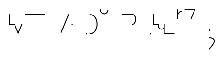<br/>
<br/>

<br/>
<br/>

<br/>
<br/>
<br/>
<br/>
<br/>
<br/>

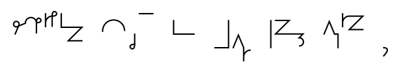<br/>
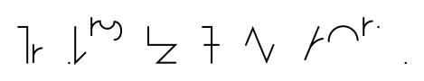<br/>
<br/>
<br/>
<br/>
<br/>
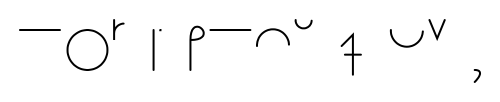<br/>
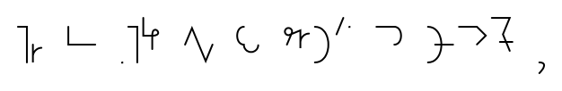<br/>
<br/>

<br/>
<br/>
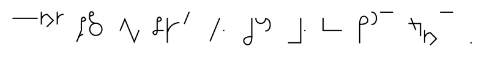<br/>
<br/>
<br/>

<br/>
<br/>
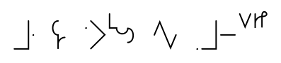<br/>
<br/>
<br/>
<br/>
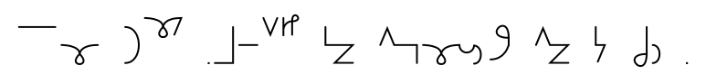<br/>

<br/>
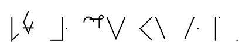<br/>
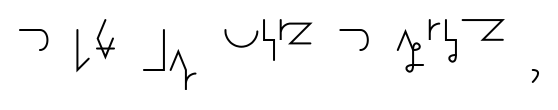<br/>
<br/>
<br/>

<br/>
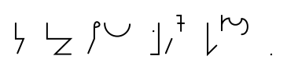<br/>
<br/>

## Earthographic

```text
Go placidly amid the noise and the haste,
and remember what peace there may be in silence.

As far as possible, without surrender,
be on good terms with all persons.
Speak your truth quietly and clearly;
and listen to others,
even to the dull and the ignorant;
they too have their story.

Avoid loud and aggressive persons;
they are vexatious to the spirit.

If you compare yourself with others,
you may become vain or bitter,
for always there will be greater and lesser persons than yourself.
Enjoy your achievements as well as your plans.
Keep interested in your own career, however humble;
it is a real possession in the changing fortunes of time.

Exercise caution in your business affairs,
for the world is full of trickery.
But let this not blind you to what virtue there is;
many persons strive for high ideals,
and everywhere life is full of heroism.
Be yourself. Especially do not feign affection.
Neither be cynical about love,
for in the face of all aridity and disenchantment,
it is as perennial as the grass.

Take kindly the counsel of the years,
gracefully surrendering the things of youth.
Nurture strength of spirit to shield you in sudden misfortune.
But do not distress yourself with dark imaginings.
Many fears are born of fatigue and loneliness.

Beyond a wholesome discipline,
be gentle with yourself.
You are a child of the universe
no less than the trees and the stars;
you have a right to be here.
And whether or not it is clear to you,
no doubt the universe is unfolding as it should.

Therefore be at peace with God,
whatever you conceive Him to be.
And whatever your labors and aspirations,
in the noisy confusion of life,
keep peace in your soul.

With all its sham, drudgery, and broken dreams,
it is still a beautiful world.
Be cheerful. Strive to be happy.
```
