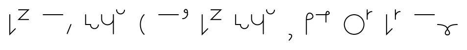
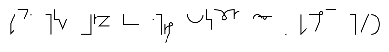
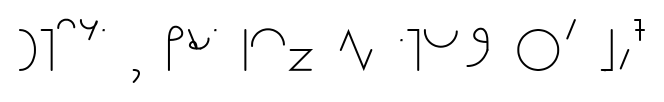
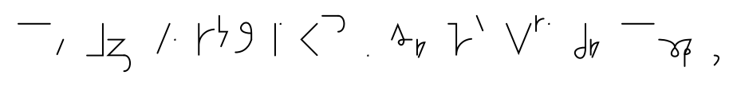
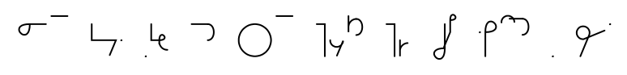
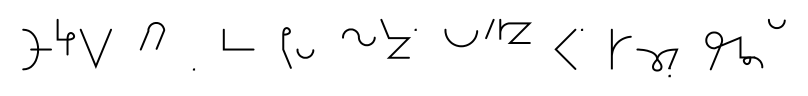
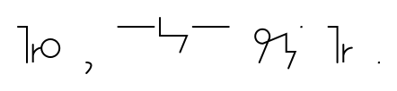

# Orwell 1984 passage

1984 is a dystopian novel and cautionary tale by English writer George Orwell.

See [original text on Project Gutenberg](https://gutenberg.net.au/ebooks01/0100021.txt).

Below is a [paragraph that is popular on /r/shorthand](https://www.reddit.com/r/shorthand/search/?sort=new&restrict_sr=on&q=flair%3A%2BSystemSample(1984)) subreddit.

## Ponish

<br/>
<br/>
<br/>
<br/>
<br/>
<br/>
<br/>
<br/>
<br/>
<br/>
<br/>
<br/>
<br/>
<br/>
<br/>
<br/>
<br/>
<br/>


## Earthographic

```text
The thing that he was about to do was to open a diary. This was not illegal
(nothing was illegal, since there were no longer any laws), but if detected
it was reasonably certain that it would be punished by death, or at least
by twenty-five years in a forced-labour camp. Winston fitted a nib into
the penholder and sucked it to get the grease off. The pen was an archaic
instrument, seldom used even for signatures, and he had procured one,
furtively and with some difficulty, simply because of a feeling that the
beautiful creamy paper deserved to be written on with a real nib instead
of being scratched with an ink-pencil. Actually he was not used to writing
by hand. Apart from very short notes, it was usual to dictate everything
into the speak-write which was of course impossible for his present
purpose. He dipped the pen into the ink and then faltered for just a
second. A tremor had gone through his bowels. To mark the paper was the
decisive act. In small clumsy letters he wrote: April 4th, 1984.
```
